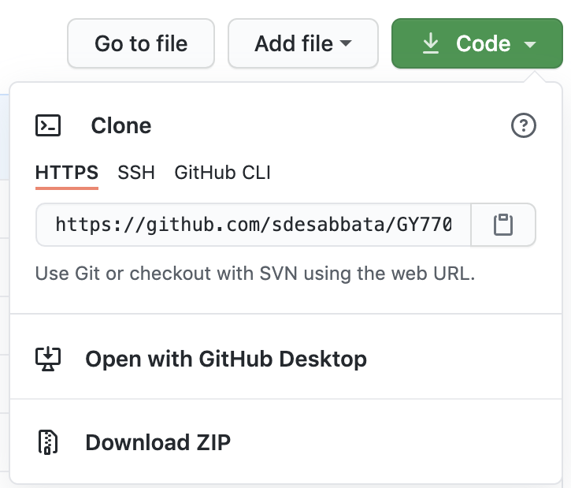

# GY7702 Assignment 

## :wave: Introduction <a name="introduction"></a>
This is a repository for the [**GY7702 R for Data Science**](https://le.ac.uk/modules/2020/gy7702) assignment at the University of Leicester. 
The aim of this assignment was to explore various aspects of the R programming language through the use of popular libraries and real-life data. 
Additionally, this was a fantastic exercise in the exploration of Github, README.md files and professional coding practice. 

PS. I love emojis 

This assignment is broken down into 4 stages: 

1. Basic vector manipulation with example survey data. 
2. Exploring table operations with the *penguins* table in *palmerpenguins*.
3. Reading data with *readr* and utilizing UK COVID-19 data 
4. Analysis of COVID-19 cases with accompanying UK population data

## :dog: Table of contents 
* [General info](#introduction)
* [Prerequisites](#prerequisites)
* [Data](#data)
* [Usage](#usage)
* [Guide to the files](#guide)

## :rose: Prerequisites <a name="prerequisites"></a>
The dependencies for the assignment are:
* [tidyverse](https://www.tidyverse.org/)
* [dplyr](https://dplyr.tidyverse.org/)
* [knitr](https://yihui.org/knitr/)
* [palmerpenguins](https://allisonhorst.github.io/palmerpenguins/articles/intro.html)
* [readr](https://readr.tidyverse.org/)
* [ggplot2](https://ggplot2.tidyverse.org/)
* [gridExtra](https://cran.r-project.org/web/packages/gridExtra/gridExtra.pdf)
* [kableExtra](https://haozhu233.github.io/kableExtra/)

Note, some of these (dplyr and ggplot2 for example) are included within the tidyverse. However, in the spirit of transparency I thought I would list them all 

## :evergreen_tree: Data <a name="data"></a>
The data used in this assignment is in [data](https://github.com/sdesabbata/GY7702_CW1_example_repo/tree/master/data). There are two .csv files:
* **covid19_cases_20200301_20201017.csv**
  + UK Covid-19 daily and cumulative cases 01/03/2020 - 17/10/2020 
* **lad19_population.csv**
  + UK population per local authority 

This repository contains public sector information licensed under the [Open Government Licence v3.0](http://www.nationalarchives.gov.uk/doc/open-government-licence/version/3/): covid19_cases_20200301_20201017.csv and lad19_population.csv. See also [Coronavirus (COVID-19) in the UK](https://coronavirus.data.gov.uk/details/cases) and [Office for National Statistics](https://geoportal.statistics.gov.uk/).

## :lemon: Usage <a name="usage"></a>
* To clone this git repository using [Git Bash](https://gitforwindows.org/):
```r
$ git clone https://github.com/sdesabbata/GY7702_CW1_example_repo.git
```
* Alternatively, press the green button at the top of this page and unzip the folder in an appropriate place

  

## :octopus: Guide to the files <a name="guide"></a>
* **Master_code.R**  
  + In this file you will find 4 sections that address the 4 questions of the assignment
  + Highly commented, raw code with no further comments on the data analysis
* **GY7702_CW1_Submission.Rmd** 
  + An R Markdown version of *Master_code.R*.
  + Contains further analysis of the data such as short paragraphs on what the data tells us  
  + While I am working in *Master_code.R* now, I predict that the work flow will move over mainly to this file 
* **GY7702_CW1_Submission.pdf**
  + A .pdf file created when *GY7702_CW1_Submission.Rmd* is executed or *knitted*
* **Notes.R**
  + Archived code that I was too scared to delete at the time
